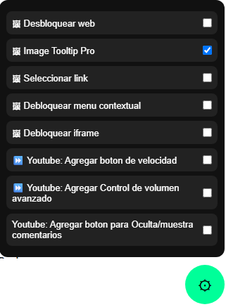

# Multi Modules Lite

**Última Actualización:** 14 de julio de 2026

Framework modular para **Tampermonkey** que reúne múltiples mejoras para distintos sitios web en un único UserScript. Cada función se encuentra implementada como un módulo independiente que puede activarse o desactivarse individualmente desde un panel flotante moderno.

## 📖 Descripción

**Multi Modules Lite** es un framework modular para **Tampermonkey** diseñado para agrupar diversas utilidades en un solo script.

Cada característica funciona como un módulo independiente cargado mediante `@require`, lo que facilita mantener el código organizado y ampliar el proyecto simplemente agregando nuevos módulos.

El usuario puede habilitar o deshabilitar cada módulo desde un menú flotante integrado, sin necesidad de modificar el código fuente.

---

# 📥 Instalación

1. Instala la extensión **Tampermonkey** en tu navegador.

2. Instala el script desde GitHub:

**➡️ [Instalar Script](https://github.com/wernser412/Multi-Modules-lite/raw/refs/heads/main/Multi%20Modules%20Lite.user.js)**

---

# ✨ Características

- ⚙ Framework modular basado en módulos independientes.
- 🧩 Carga automática de módulos mediante `@require`.
- 🎛 Panel flotante moderno para administrar los módulos.
- 🔘 Activación y desactivación individual de cada módulo.
- 🚀 Botón flotante siempre disponible.
- 📌 Posibilidad de mostrar u ocultar el botón desde el menú de Tampermonkey.
- 🔢 Contador de módulos activos.
- 📂 Organización por categorías.
- 💾 Configuración guardada automáticamente.
- 📱 Compatible con navegación dinámica (SPA).
- 🖥 Compatible con pantalla completa (Fullscreen API).
- 🔄 Restauración automática del panel tras cambios dinámicos del DOM.
- 🎨 Interfaz moderna con animaciones suaves.
- 🛡 Sistema preparado para agregar nuevos módulos fácilmente.

---

# 🧩 Módulos incluidos

Actualmente el proyecto incluye los siguientes módulos:

- 🔓 **Ultra Unlock**
  - Elimina diversas restricciones impuestas por sitios web.
  - Permite copiar texto.
  - Permite seleccionar contenido bloqueado.
  - Reactiva el menú contextual.
  - Desbloquea eventos bloqueados por JavaScript.

- 🖼 **Image Tooltip**
  - Muestra una vista previa ampliada al pasar el cursor sobre imágenes.

- 🔗 **Link Select**
  - Permite seleccionar fácilmente el texto de los enlaces.

- 🪟 **Iframe Unlock**
  - Elimina restricciones comunes aplicadas a iframes.

- ▶ **YouTube Speed Button**
  - Añade controles rápidos para modificar la velocidad de reproducción.

- 🔊 **YouTube Volume Boost**
  - Permite aumentar el volumen por encima del límite normal.

- 💬 **YouTube Toggle Comments**
  - Permite mostrar u ocultar rápidamente la sección de comentarios.

---

# 🖥️ Uso

1. Instala el UserScript.
2. Aparecerá el botón flotante ⚙.
3. Haz clic sobre él para abrir el panel.
4. Activa únicamente los módulos que desees utilizar.
5. Los cambios se aplican inmediatamente.

---

# ⚙ Panel de control

El panel permite:

- Activar un módulo.
- Desactivar un módulo.
- Activar todos los módulos.
- Desactivar todos los módulos.
- Visualizar los módulos organizados por categorías.
- Ver la cantidad de módulos activos.

---

# 💾 Configuración

El estado de cada módulo se guarda automáticamente utilizando el almacenamiento de Tampermonkey.

Al volver a abrir el navegador, los módulos previamente activados se restauran automáticamente.

---

# 🧩 Arquitectura modular

Cada módulo se desarrolla como un archivo JavaScript independiente y se carga automáticamente mediante `@require`.

Esto permite:

- Agregar nuevos módulos sin modificar el núcleo.
- Mantener el código organizado.
- Facilitar el mantenimiento del proyecto.
- Compartir módulos entre distintos proyectos.

---

# 🌐 Sitios compatibles

El framework puede ejecutarse en cualquier sitio web.

Algunos módulos están diseñados específicamente para determinados sitios, como YouTube, mientras que otros funcionan de forma general en cualquier página.

---

# 📄 Licencia

Este proyecto se distribuye bajo la licencia **MIT**.

Consulta el archivo **LICENSE** para más información.
